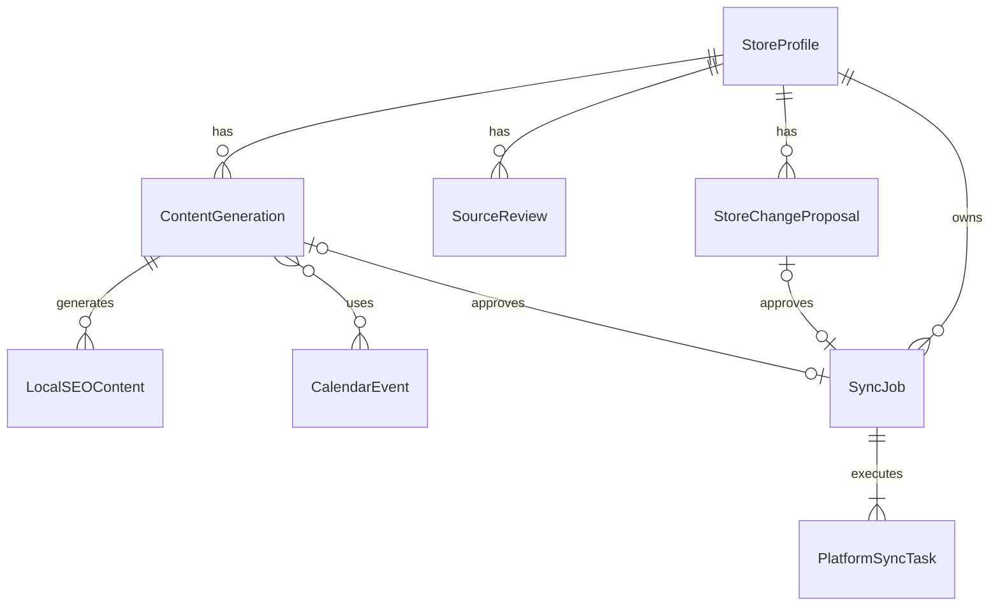

# MapKeeper Data Model

> 상태: **Canonical / migration head 0003**
> 기준 코드: `2026-08-17 current working tree` (base `12687c2ed099cc6369d45b59791fa3ca62ea106d`)
> 최종 대조일: `2026-08-17`
> 담당: 백엔드

## 1. Migration

| Revision | 내용 |
|---|---|
| `0001` | StoreProfile, Proposal, Generation, LocalSEOContent, SyncJob, PlatformSyncTask |
| `0002` | SourceReview |
| `0003` | `ContentPurpose` Enum과 `content_generation.purpose` |
| `0004` (planned) | `LocalSEOContent` 플랫폼별 승인 상태, `CalendarEvent` |

현재 Alembic head는 `0003`이다.

## 2. Enum

| 이름 | 값 |
|---|---|
| `platform` | `google`, `naver`, `kakao` |
| `proposal_status` | `DRAFT`, `APPROVED`, `REJECTED` |
| `content_generation_status` | `DRAFT`, `APPROVED`, `REJECTED` |
| `content_purpose` | `INTRODUCTION`, `NEWS` |
| `sync_source_type` | `STORE_CHANGE_PROPOSAL`, `CONTENT_GENERATION` |
| `sync_job_status` | `PENDING`, `PROCESSING`, `PARTIAL_SUCCESS`, `SUCCESS`, `FAILED`, `RETRYING` |
| `platform_sync_task_status` | `PENDING`, `PROCESSING`, `SUCCESS`, `FAILED`, `RETRYING` |

## 3. StoreProfile

공식 데모 기준값은 UUID `11111111-1111-4111-8111-111111111111`, 매장명 `만두전골 하우스`, 공개 주소 `서울특별시 관악구 시연로 12`, 대표 메뉴 `만두전골`이다. 프론트 화면·fixture·DB seed·생성 입력은 이 프로필을 공통 기준으로 사용한다.

승인된 최신 매장 목표 상태다.

```text
id: UUID PK
storeName: text
publicAddress: text
businessHours: JSONB
temporaryClosureStartDate: date nullable
temporaryClosureEndDate: date nullable
representativeMenuName: varchar(50)
representativePhone: text
parkingInfo: varchar(50) nullable
platformAccountRefs: JSONB
createdAt: timestamptz
updatedAt: timestamptz
```

`platformAccountRefs`에는 공개 계정 식별자와 Secret Manager 참조만 저장하고 Token 원문을 저장하지 않는다.

## 4. StoreChangeProposal

```text
id: UUID PK
storeProfileId: UUID FK → StoreProfile
recognizedTextMasked: varchar(500)
changes: JSONB
status: ProposalStatus
approvedAt: timestamptz nullable
rejectedAt: timestamptz nullable
createdAt: timestamptz
updatedAt: timestamptz
```

`changes`는 API Contract의 `ProposalChange` discriminated union을 통과한 값만 저장한다. 한 문장이 여러 항목을 말하면 항목마다 하나씩 담기므로 `changes`는 여러 개일 수 있다.

거절된 요청은 Proposal을 만들지 않으므로 `error.failure`의 실패 원인은 저장하지 않는다. `unmappedRequests`도 저장하지 않고 `recognizedTextMasked`와 `changes`에서 매번 파생한다 — 변경안을 수정하면 누락 목록도 함께 움직여야 한다.

## 5. SourceReview

```text
id: UUID PK
storeProfileId: UUID FK → StoreProfile
bodyMasked: text
createdAt: timestamptz
```

UC2가 선택적으로 참고하는 마스킹 완료 리뷰다. 데모 seed는 128건을 제공하지만 API는 대표 리뷰 최대 10건만 반환한다.

## 6. ContentGeneration

세 플랫폼 결과의 공통 입력과 전체 승인 상태다.

```text
id: UUID PK
storeProfileId: UUID FK → StoreProfile
briefText: varchar(500)
purpose: ContentPurpose NOT NULL DEFAULT INTRODUCTION
seedKeywords: text[]
sourceReviewIds: UUID[] nullable
calendarEventIds: UUID[] nullable
status: ContentGenerationStatus
revision: integer CHECK revision >= 1
approvedAt: timestamptz nullable
rejectedAt: timestamptz nullable
createdAt: timestamptz
updatedAt: timestamptz
```

`DRAFT`에서만 재생성·거절·승인할 수 있다. 재생성 시 revision이 증가한다.

## 7. LocalSEOContent

```text
id: UUID PK
contentGenerationId: UUID FK → ContentGeneration
platform: Platform
draftText: varchar(750)
keywords: text[]
contentRules: JSONB
createdAt: timestamptz
updatedAt: timestamptz
UNIQUE(contentGenerationId, platform)
```

PM Beta에서는 플랫폼별 승인·게시를 지원하므로 다음 필드를 추가한다. 기존 `ContentGeneration.status`는 전체 Generation의 생명주기와 전체 승인 편의 동작을 나타내며, 외부 반영 가능 여부는 플랫폼 상태가 우선한다.

```text
approvalStatus: DRAFT | APPROVED | REJECTED
approvedAt: timestamptz nullable
```

플랫폼별 승인 전에는 해당 플랫폼 Task를 만들지 않는다. 이 변경은 다음 migration에서 반영한다.

## 8. CalendarEvent

공식 공휴일·아주대학교 공개 일정과 관리자 등록 일정을 저장한다.

```text
eventId: UUID PK
title: text
category: HOLIDAY | UNIVERSITY
targetAudience: text nullable
startDate: date
endDate: date
sourceType: OFFICIAL_HOLIDAY | AJOU_OFFICIAL | ADMIN
sourceUrl: text
retrievedAt: timestamptz
lastVerifiedAt: timestamptz
isPublic: boolean
status: ACTIVE | CANCELLED | EXPIRED
```

개인 교직원 일정과 비공개 일정은 저장하지 않는다. 중복 식별과 최신성 검사는 `sourceType`, `sourceUrl`, 기간, 제목 조합을 사용한다.

## 9. SyncJob

```text
id: UUID PK
storeProfileId: UUID FK → StoreProfile
sourceType: SyncSourceType
storeChangeProposalId: UUID FK nullable
contentGenerationId: UUID FK nullable
status: SyncJobStatus
approvedAt: timestamptz
approvedBy: UUID
idempotencyKey: varchar(128)
idempotencyRequestHash: char(64)
createdAt: timestamptz
updatedAt: timestamptz
UNIQUE(approvedBy, idempotencyKey)
```

UC1·UC2 원본 FK 중 정확히 하나만 값이 있어야 하며 `sourceType`과 일치해야 한다.

## 10. PlatformSyncTask

```text
id: UUID PK
syncJobId: UUID FK → SyncJob
platform: Platform
status: PlatformSyncTaskStatus
attemptCount: integer CHECK 0 <= attemptCount <= 3
nextRetryAt: timestamptz nullable
errorCode: text nullable
errorMessage: text nullable
retryable: boolean nullable
lastAttemptAt: timestamptz nullable
createdAt: timestamptz
updatedAt: timestamptz
UNIQUE(syncJobId, platform)
```

`nextRetryAt`은 지수 백오프 예약 시각이다. 현재 runner가 이 시각을 기다리지 않는 구현 격차가 있다.

## 11. 핵심 DB 제약

```text
StoreProfile temporary closure
- 시작일·종료일은 모두 null 또는 모두 값
- endDate >= startDate

ContentGeneration
- revision >= 1

LocalSEOContent
- UNIQUE(contentGenerationId, platform)

SyncJob
- UC1/UC2 source FK XOR
- UNIQUE(approvedBy, idempotencyKey)

PlatformSyncTask
- UNIQUE(syncJobId, platform)
- CHECK(attemptCount BETWEEN 0 AND 3)
```

## 12. 승인 트랜잭션

### UC1

```text
lock Proposal
→ DRAFT·stale·effective-change 검증
→ StoreProfile 갱신
→ Proposal APPROVED
→ SyncJob 생성
→ PlatformSyncTask 3개 생성
→ commit
→ background runner
```

### UC2

```text
lock ContentGeneration
→ DRAFT·3사 결과 검증
→ Generation APPROVED
→ SyncJob 생성
→ PlatformSyncTask 3개 생성
→ commit
→ background runner
```

## 13. ERD



## 14. 보안 불변식

- `recognizedTextMasked`, `SourceReview.bodyMasked`에는 고객 PII 원문을 저장하지 않는다.
- 마스킹 완료 리뷰만 Gemini 입력으로 사용한다.
- 외부 응답 원문·Token·요청 서명을 오류 컬럼에 저장하지 않는다.
- `approvedBy`는 User FK가 아닌 MVP 고정 actor다.
