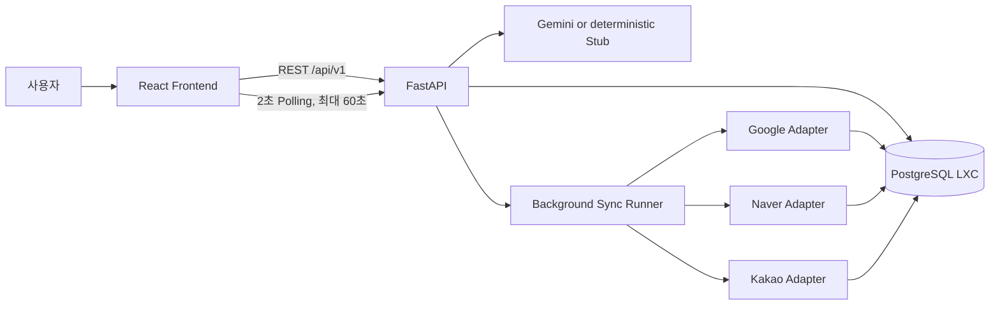

# MapKeeper 구현 계획과 현재 아키텍처

> 상태: **Canonical / PM Beta implementation baseline with remaining gaps**
> 기준 코드: `2026-08-17 current working tree` (base `12687c2ed099cc6369d45b59791fa3ca62ea106d`)
> PM 범위 기준일: `2026-08-26`
> 최종 대조일: `2026-08-30`
> 공동 담당: 프론트엔드·백엔드

## 1. 기술 구성

| 영역 | 기술 |
|---|---|
| Frontend | React, TypeScript, Vite, Vitest, Web Speech API |
| Backend | Python 3.11, FastAPI, Pydantic v2, SQLAlchemy 2 async |
| Database | 별도 PostgreSQL LXC, Alembic migration |
| AI | Gemini HTTP adapter, 키 미설정 시 결정적 Stub |
| External publish | PlatformAdapter Protocol, 현재 AcceptingAdapter 시뮬레이션 |
| Runtime | Docker Compose, Ubuntu VM |
| CI/CD | GitHub Actions, GHCR, Tailscale SSH 배포 |

## 2. 전체 흐름



현재 세 플랫폼 Adapter는 실제 외부 호출 대신 성공을 재현한다.

## 3. UC1 흐름

```text
Web Speech 또는 텍스트
→ 고객 PII 마스킹
→ 결정적 intent parser
→ 필요 시 Gemini 구조화
→ ProposalChange schema 재검증
→ DRAFT 저장
→ 사용자 검토·수정·거절·승인
→ 승인 트랜잭션
→ SyncJob + PlatformSyncTask 3개
→ commit 후 BackgroundTasks
```

## 4. UC2 흐름

```text
리뷰 요약 조회
→ INTRODUCTION / NEWS 선택
→ 인터뷰 답변 + 빠른 시작 + 음성/텍스트
→ briefText + seedKeywords + sourceReviewIds
→ Gemini 또는 Stub
→ 플랫폼별 LocalSEOContent 3개
→ 전체 재생성·거절·승인
→ 승인 트랜잭션
→ SyncJob + PlatformSyncTask 3개
```

## 5. 승인 트랜잭션

### UC1

1. Proposal을 row lock으로 조회한다.
2. DRAFT와 현재 StoreProfile 값 일치를 확인한다.
3. StoreProfile을 승인 목표 상태로 갱신한다.
4. Proposal을 APPROVED로 변경한다.
5. 승인된 플랫폼에 대한 PlatformSyncTask만 생성한다.
6. commit 후 runner를 등록한다.

### UC2

1. ContentGeneration을 row lock으로 조회한다.
2. DRAFT와 3사 결과 존재를 확인한다.
3. Generation을 APPROVED로 변경한다.
4. 승인된 플랫폼에 대한 PlatformSyncTask만 생성한다.
5. commit 후 runner를 등록한다.

## 6. 데이터와 API 기준

- OpenAPI 생성본: `workspace/backend/openapi.json`
- API 설명: `api-contract.md`
- DB 기준: `data-model.md`와 Alembic head `0003`
- 프론트 API 호출: `workspace/frontend/src/services/`
- 백엔드 route: `workspace/backend/src/mapkeeper/api/routes/`

OpenAPI는 backend 코드에서 생성하고 CI에서 커밋된 파일과 drift를 검사한다. 프론트엔드는 같은 계약을 사용해야 하며 수동 타입 차이는 제거해 나간다.

## 7. 구현 단계와 상태

| Phase | 범위 | 상태 |
|---|---|---|
| 1 | 공통 Envelope·Enum·OpenAPI | Implemented |
| 2 | PostgreSQL·ORM·Migration·seed | Implemented, head `0003` |
| 3 | 승인·멱등성·상태 집계·복구 | Implemented |
| 4 | UC1 API·Gemini 구조화·FE 흐름 | Implemented |
| 5 | UC2 3사 생성·전체 승인·FE 흐름 | Implemented (legacy baseline) |
| 6 | 리뷰 요약·128건 seed·NEWS 목적 | Implemented after original v0.2 |
| 7 | 플랫폼별 오류·실제 예약 재시도 | Implemented |
| 8 | 2초·60초 Polling·다시 확인 | Implemented |
| 9 | CI/CD·Ubuntu VM 배포 | Implemented |
| 10 | 문서 기준본 재정리 | Implemented |
| 11 | PM P0 사실성·UC1 복합 요청·질문 수·플랫폼별 결과/승인 | UC1 상대 날짜·기간·복합·실패 원인 Implemented (T256), 나머지 Planned |
| 12 | PM P0 생성 상태·지연·실패 복구·매장 정합성 | Planned |
| 13 | PM P1 공휴일·아주대 일정·질문 분기 | Planned |
| 14 | PM P1 플랫폼 규칙·프로필 진단·게시 준비도 | Planned |

## 8. 남은 구현 우선순위

### P0, Beta 차단 항목

1. ~~UC1 상대 날짜·기간·복합 요청을 모두 구조화하거나 미지원 항목을 명시한다.~~ T256 완료.
2. ~~UC1 실패 원인별 안내와 입력 보존·재시도를 제공한다.~~ T256 완료.
3. UC2 리뷰 0건에서 키워드·장점을 생성하지 않고, 입력에 없는 메뉴·가격·혜택을 차단한다.
4. UC2 질문 수를 3개 이내로 고정하고 추가 확인을 별도 단계로 표시한다.
5. UC2 플랫폼별 결과·직접 편집·부분 재생성·개별 승인 흐름을 구현한다.
6. 생성 단계, 10초 지연 안내, 30초 재시도/백그라운드 경로를 구현한다.
7. 테스트 매장 주소·메뉴·리뷰·키워드 정합성을 검증하고 실제 연동과 모의 연동을 구분한다.

### P1, Beta 경쟁력 항목

1. 공식 공휴일·아주대학교 공개 일정 수집·검색·출처 추적을 구현한다.
2. 일정별 질문 분기와 날짜 확인 화면을 구현한다.
3. 플랫폼별 생성 규칙, 프로필 진단, 게시 준비도를 구현한다.
4. 최신 변경의 CI·개발 배포·실제 모바일 수동 검증을 갱신한다.

### P2

실제 3사 자동 게시, 개인 일정, 커뮤니티·매출·결제 기능은 Beta 필수 범위에서 제외한다.

## 9. 검증 전략

- Python: Ruff format/lint, basedpyright, pytest, PostgreSQL 통합 테스트
- Frontend: ESLint, TypeScript typecheck, Vitest, Vite build
- API: OpenAPI regeneration drift guard
- DB: migration upgrade와 실제 제약 위반 테스트
- E2E: UC1·UC2 생성→승인→SyncJob 종료 상태
- Deployment: GHCR 이미지, migration, seed, health, rollback
- Manual QA: 모바일 화면, 음성 fallback, 한글 줄바꿈, 실패·재시도 UX
- PM Beta QA: 절대·상대 날짜, 기간·복합 요청, 리뷰 0건/리뷰 있음, 공휴일·아주대 일정, 플랫폼별 승인, 허위 생성 방지
