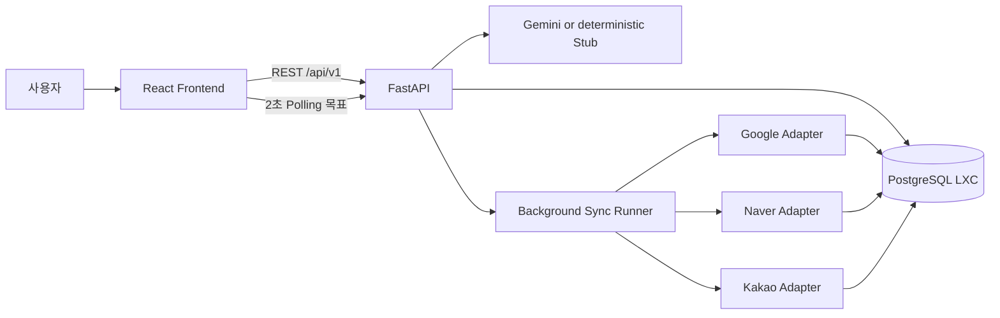

# MapKeeper 구현 계획과 현재 아키텍처

> 상태: **Canonical / implemented baseline with remaining gaps**
> 기준 커밋: `206ad82198aa8c76652f3001ee6bd31d24cd360d`
> 최종 대조일: `2026-08-17`
> 공동 담당: 프론트엔드·백엔드

## 1. 기술 구성

| 영역 | 기술 |
|---|---|
| Frontend | React, TypeScript, Vite, Vitest, Web Speech API |
| Backend | Python 3.11, FastAPI, Pydantic v2, SQLAlchemy 2 async |
| Database | 별도 PostgreSQL LXC, Alembic migration |
| AI | Gemini HTTP adapter, 키 미설정 시 결정적 Stub |
| External publish | PlatformAdapter Protocol, 현재 AcceptingAdapter 시뮬레이션 |
| Runtime | Docker Compose, Ubuntu VM |
| CI/CD | GitHub Actions, GHCR, Tailscale SSH 배포 |

## 2. 전체 흐름



현재 세 플랫폼 Adapter는 실제 외부 호출 대신 성공을 재현한다.

## 3. UC1 흐름

```text
Web Speech 또는 텍스트
→ 고객 PII 마스킹
→ 결정적 intent parser
→ 필요 시 Gemini 구조화
→ ProposalChange schema 재검증
→ DRAFT 저장
→ 사용자 검토·수정·거절·승인
→ 승인 트랜잭션
→ SyncJob + PlatformSyncTask 3개
→ commit 후 BackgroundTasks
```

## 4. UC2 흐름

```text
리뷰 요약 조회
→ INTRODUCTION / NEWS 선택
→ 인터뷰 답변 + 빠른 시작 + 음성/텍스트
→ briefText + seedKeywords + sourceReviewIds
→ Gemini 또는 Stub
→ 플랫폼별 LocalSEOContent 3개
→ 전체 재생성·거절·승인
→ 승인 트랜잭션
→ SyncJob + PlatformSyncTask 3개
```

## 5. 승인 트랜잭션

### UC1

1. Proposal을 row lock으로 조회한다.
2. DRAFT와 현재 StoreProfile 값 일치를 확인한다.
3. StoreProfile을 승인 목표 상태로 갱신한다.
4. Proposal을 APPROVED로 변경한다.
5. SyncJob과 플랫폼 Task 세 개를 생성한다.
6. commit 후 runner를 등록한다.

### UC2

1. ContentGeneration을 row lock으로 조회한다.
2. DRAFT와 3사 결과 존재를 확인한다.
3. Generation을 APPROVED로 변경한다.
4. SyncJob과 플랫폼 Task 세 개를 생성한다.
5. commit 후 runner를 등록한다.

## 6. 데이터와 API 기준

- OpenAPI 생성본: `workspace/backend/openapi.json`
- API 설명: `api-contract.md`
- DB 기준: `data-model.md`와 Alembic head `0003`
- 프론트 API 호출: `workspace/frontend/src/services/`
- 백엔드 route: `workspace/backend/src/mapkeeper/api/routes/`

OpenAPI는 backend 코드에서 생성하고 CI에서 커밋된 파일과 drift를 검사한다. 프론트엔드는 같은 계약을 사용해야 하며 수동 타입 차이는 제거해 나간다.

## 7. 구현 단계와 상태

| Phase | 범위 | 상태 |
|---|---|---|
| 1 | 공통 Envelope·Enum·OpenAPI | Implemented |
| 2 | PostgreSQL·ORM·Migration·seed | Implemented, head `0003` |
| 3 | 승인·멱등성·상태 집계·복구 | Implemented |
| 4 | UC1 API·Gemini 구조화·FE 흐름 | Implemented |
| 5 | UC2 3사 생성·전체 승인·FE 흐름 | Implemented |
| 6 | 리뷰 요약·128건 seed·NEWS 목적 | Implemented after original v0.2 |
| 7 | 플랫폼별 오류·재시도 UI | Implemented with backoff gap |
| 8 | 2초·60초 Polling | Not implemented |
| 9 | CI/CD·Ubuntu VM 배포 | Implemented |
| 10 | 문서 기준본 재정리 | Implemented |

## 8. 남은 구현 우선순위

1. Polling을 2초 간격·60초 제한·다시 확인 방식으로 수정한다.
2. runner가 `nextRetryAt` 이후에만 RETRYING Task를 실행하도록 한다.
3. PII 마스킹 범위와 로그 안전 테스트를 강화한다.
4. 프론트 응답을 OpenAPI 기반 런타임 스키마로 검증한다.
5. 비문자 키워드를 조용히 삭제하지 않고 422로 거절한다.
6. 실제 3사 Adapter는 MVP 이후 별도 연동 검증으로 진행한다.

## 9. 검증 전략

- Python: Ruff format/lint, basedpyright, pytest, PostgreSQL 통합 테스트
- Frontend: ESLint, TypeScript typecheck, Vitest, Vite build
- API: OpenAPI regeneration drift guard
- DB: migration upgrade와 실제 제약 위반 테스트
- E2E: UC1·UC2 생성→승인→SyncJob 종료 상태
- Deployment: GHCR 이미지, migration, seed, health, rollback
- Manual QA: 모바일 화면, 음성 fallback, 한글 줄바꿈, 실패·재시도 UX
